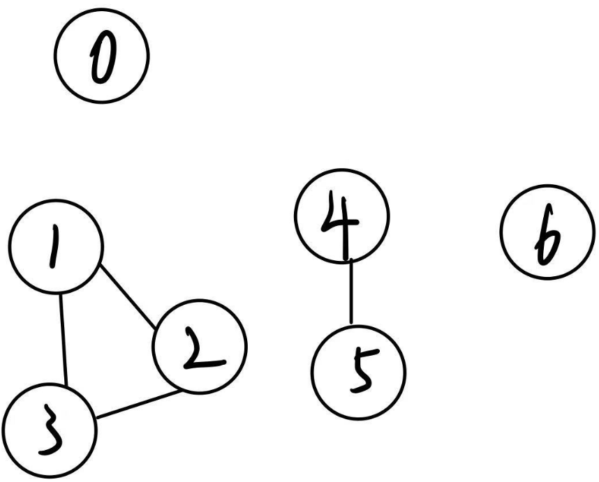

### 并查集使用场景

当我们需要计算元素一共有几个类别，或者判单某些元素是否属于同一个类别 <br>
例如：当我们需要判断一个图有几个环连通分量的时候（如下图所示）就可以使用该数据结构

<center>该无相图中一共有4个连通分量</center>
这里的0号和1号属于不同的连通分量，4号和5号属于同一连通分量，图中一共有五个连通分量。

### 并查集主要操作
#### 1. int find(int x); 
查找x对应的类别号，通过返回值不同可以判断是否属于同一类型。
#### 2. void join(int x,int y);
将x号元素和y号元素连接在一起，让其属于同一类。
#### 3. int count();
返回一共有多少类别。

### 实现
```c++
class Unit_Set {
private:
    int n;
    int *parent; // 指向父节点
    int *rank;   // 深度

public:
    /**
     * 
     **/
    Unit_Set(int n) : n(n) {
        parent = new int[n];
        rank = new int[n];
        for (int i = 0; i < n; i++) {
            parent[i] = i;
            rank[i] = 0;
        }
    }

    ~Unit_Set() {
        delete[] parent;
        delete[] rank;
    }

    int find(int x) {
        if (x == parent[x])
            return x;
        return parent[x] = find(parent[x]); // 路径压缩
    }

    void join(int x, int y) {
        int fx = find(x);
        int fy = find(y);
        if (fx == fy)
            return; // 已经在同一集合中
        if (rank[fx] < rank[fy]) {
            parent[fx] = fy;
        } else if (rank[fx] > rank[fy]) {
            parent[fy] = fx;
        } else {
            parent[fx] = fy;
            rank[fy]++;
        }
    }

    int count() {
        int count = 0;
        for (int i = 0; i < n; i++) {
            if (parent[i] == i)
                count++;
        }
        return count;
    }
};
```

### 例题
[3551. 数位和排序需要的最小交换次数](https://leetcode.cn/problems/minimum-swaps-to-sort-by-digit-sum/)